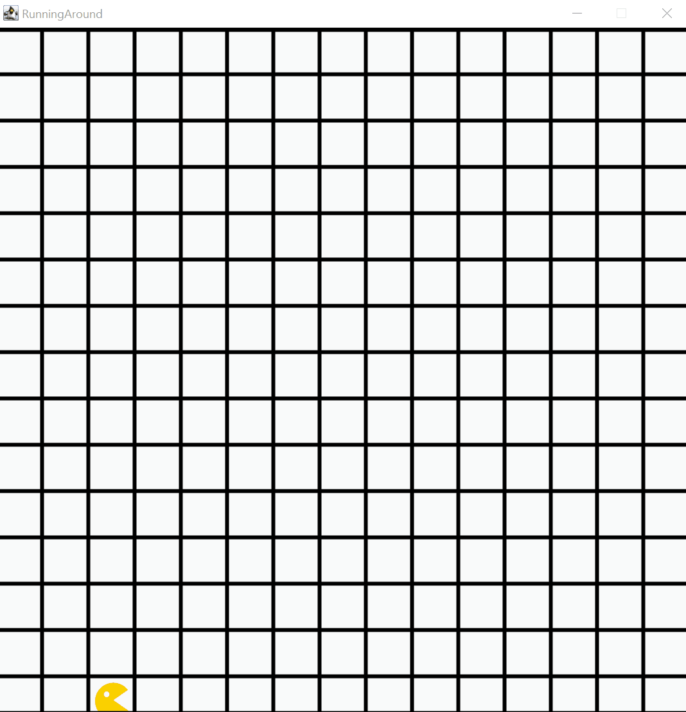

# Running Around

Bouncer bewegt sich in einer endlosen Animation entlang der Kartenränder. Er starter in der unteren, linken Ecke der Welt und blickt nach Westen. Bouncer läuft schrittweise bis in die jeweils gegenüber liegende Ecke, richtet sich danach durch eine Linksdrehung auf die nächste Ecke aus. Dieser Vorgang wiederholt sich solange Bouncer am Ende der Sequenz nicht durch ein Hindernis blockiert ist. Durch diesen Ablauf kann in der leeren Welt ohne Hindernisse keine Abbruchbedingung für die umschließende Schleife erreicht werden.

## Relevante Bezüge zum OOP-Kurs

Anhand dieses Beispiels kann neben des systematischen Programmaufbaus und der allgemeinen Verwendung von Schleifen auch die (hier gewollte) Kontruktion von Endlosschleifen demonstriert werden. Auf dieser Basis kann das, hier bewusst fehlende, herbeiführen sinnvoller Abbruchbedingungen im Schleifenrumpf thematisiert werden.

- Struktureller Aufbau und Verwendung eines Bouncer-Programms
- Verwendung von Schleifen (`while`) zur quantitativ unspezifischen Wiederholung von Befehlen
- Bewusster und unbewusster Einsatz von Endlosschleifen